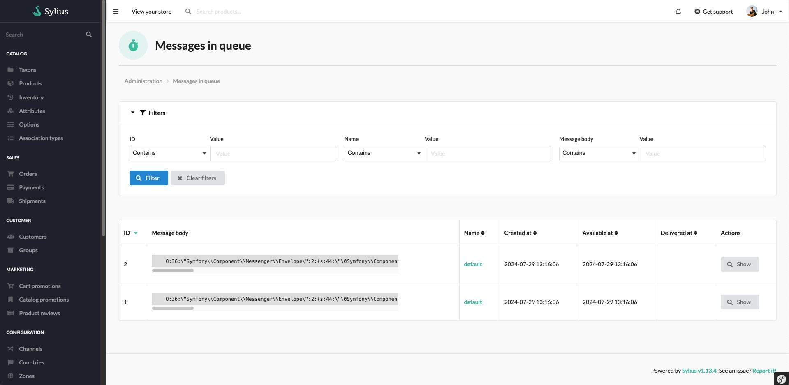
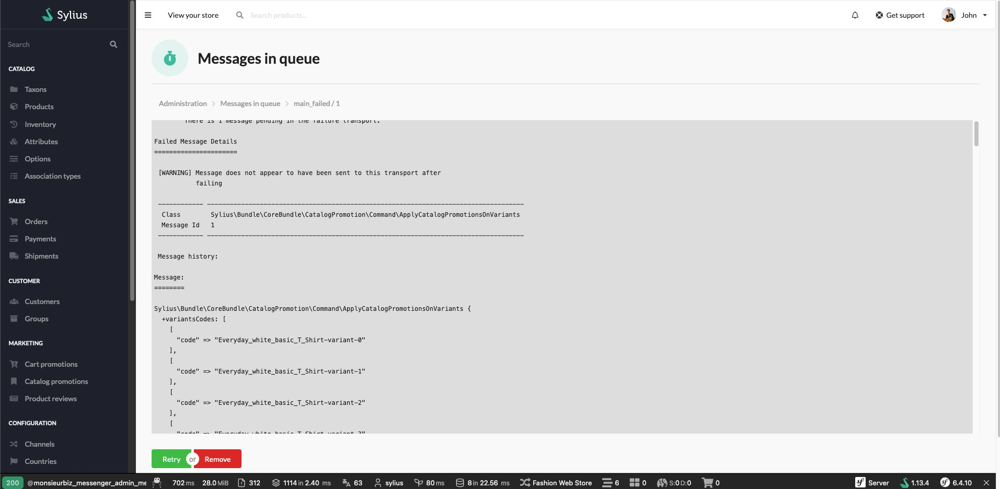

<h1 align="center">Sylius Symfony Messenger Admin</h1>

[](https://github.com/monsieurbiz/SyliusMessengerAdminPlugin/blob/master/LICENSE.txt)
[](https://github.com/monsieurbiz/SyliusMessengerAdminPlugin/actions?query=workflow%3ATests)
[](https://github.com/monsieurbiz/SyliusMessengerAdminPlugin/actions?query=workflow%3ASecurity)
[](https://github.com/monsieurbiz/SyliusMessengerAdminPlugin/actions?query=workflow%3ASecurity)

Displays Symfony Messenger messages in Sylius admin panel




## Compatibility

| Sylius Version | PHP Version |
|---|---|
| 1.12 | 8.1 - 8.2 |
| 1.13 | 8.1 - 8.2 |

## Installation

If you want to use our recipes, you can configure your composer.json by running:

```bash
composer config --no-plugins --json extra.symfony.endpoint '["https://api.github.com/repos/monsieurbiz/symfony-recipes/contents/index.json?ref=flex/master","flex://defaults"]'
```

```bash
composer require monsieurbiz/sylius-messenger-admin-plugin
```

<details><summary>For the installation without flex, follow these additional steps</summary>
<p>

Change your `config/bundles.php` file to add this line for the plugin declaration:
```php
<?php

return [
    //..
    MonsieurBiz\SyliusMessengerAdminPlugin\MonsieurBizSyliusMessengerAdminPlugin::class => ['all' => true],
];  
```

Then create the config file in `config/packages/monsieurbiz_sylius_messenger_admin_plugin.yaml` :

```yaml
imports:
    resource: '@MonsieurBizSyliusMessengerAdminPlugin/Resources/config/config.yaml'
```

Finally import the routes in `config/routes/monsieurbiz_sylius_messenger_admin_plugin.yaml` : 

```yaml
monsieurbiz_messenger_admin:
    resource: '@MonsieurBizSyliusMessengerAdminPlugin/Resources/config/routes/admin.yaml'
    prefix: '/%sylius_admin.path_name%/messages'
```

</p>
</details>

## Contributing

You can open an issue or a Pull Request if you want! 😘  
Thank you!
